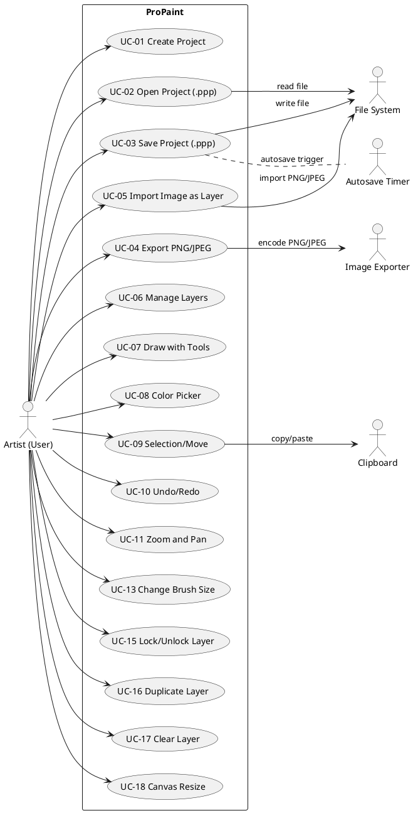

# Actors (MVP)
- Artist (User) – uses the editor.
- File System – open/save project files, import images.
- Image Exporter – encodes flattened image to PNG/JPEG.
- Autosave Timer – triggers background autosave of a temp file.
- Clipboard – copy/paste pixels or selections.

# Use Cases (MVP)
- UC-01 Create Project – start a new canvas with initial layer.
- UC-02 Open Project (.ppp) – load custom project format.
- UC-03 Save Project (.ppp) – write project to disk.
- UC-04 Export PNG/JPEG – flatten layers and export.
- UC-05 Import Image as Layer – add PNG/JPEG as a new layer.
- UC-06 Manage Layers – add, delete, rename, reorder, show/hide, set opacity.
- UC-07 Draw with Tools – pencil/brush/eraser/line on active layer.
- UC-08 Color Picker – pick color from palette/canvas.
- UC-09 Selection/Move – rectangular selection, move/transform within a layer.
- UC-10 Undo/Redo – revert/apply last operations.
- UC-11 Zoom and Pan – view navigation.
- UC-13 Change Brush Size – adjust stroke radius.
- UC-15 Lock/Unlock Layer – prevent layer edits.
- UC-16 Duplicate Layer – copy an existing layer.
- UC-17 Clear Layer – erase all pixels of a layer.
- UC-18 Canvas Resize – change document dimensions.

